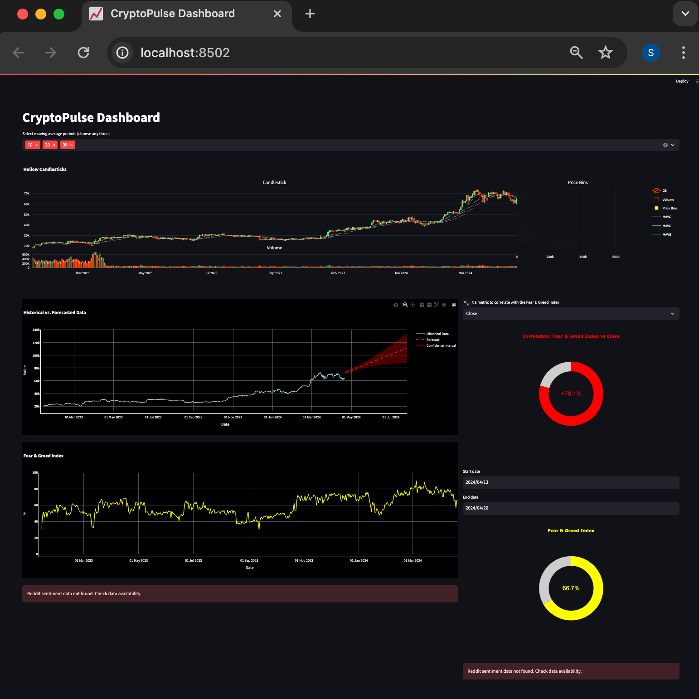

# ***`CryptoPulse: Streamlining Sentiments & Trends`***
---
---

# `Project Submission of Data Engineering Zoomcamp`
# `Author:`     Sebastian Wefers
# `Occupation:` Data Science Student

## ***Problem Definition***
---
CryptoPulse leverages data engineering practices to pipe data through anaytics pipeline to analyze cryptocurrency market sentiments and forecast trends on an interactive dashbaord. By integrating social media analysis with financial data, it provides actionable insights into crypto market dynamics. This project embodies a comprehensive end-to-end pipeline—from data ingestion and sentiment analysis to trend forecasting and interactive visualization—facilitating informed investment decisions in the volatile world of cryptocurrencies.

**`Note`**
- Unfortunately the project has not reached its end before the deadline, but will be continued. Therefore, not all components run in the cloud as intended but are at least containerized...
- The project has initally been developed locally to test and debug all components first before migrating to the cloud.
---

## ***Dashboard***

## ***Project Overview***
---
In a Nutshell the project comprises of the following components:

#### 0) *Terraform to set up google cloud infrastructure (IaC)*

#### 1) *Batch processing pipeline with spark and mage to BigQuery*
  - bitcoin trend metrics of the last year from binance's api
  - reddit text data from subreddit r/Cryptocurrency
  - a metric from alternativeme that combines a bunch of data sources to compute the sentiment like metric called "fear and greed index"

#### 2) *Sentiment Enrichment and Trend Forecasting [OPTIONAL]*
  - reddit data is being fetched from bigquery with spark, pushed through sentiment model and written back to bigquery with sentiment metrics
  - same goes for binance data, where the closing price is set as the target variable to fine tune facebook's trend forecastig model called "Prophet" and predict the next 30 days. Then written bach to dataset.

#### 3) *Interactive Streamlit Dashboard*
  - the interface runs queries against the data warehouse in bigquery and fetches all tables from the dataset to map the visualiaztions to the UI.
  - possibility to intercatively use the resulting plots by:
    - selecting date ranges
    - pronounce or outcomment visual metric components
    - zoom in - zoom out, hover, click

                                            <<<<<<<<...>>>>>>>>
                                            <<<<__DIAGRAM__>>>>
                                            <<<<<<<<...>>>>>>><

## ***`a) Set Up & Run Cloud`***
---
- The content below was the attempt to migrate the locally developed components to the cloud. Due to lack of time the code still needs to be debugged.
- Alternatively option "b) Playground" can alternatively be used to test the locally developed pipeline and play with the dashboard.
- 
### **`0) clone githib repo`**

by running: `git clone https://github.com/Ocean-code-1995/CryptoPulse-Sentiment-Trends`

### **`1) Infrastructure as Code (Terraform)`**
Use terraform to initialize cloud storage.
#### ***BigQuery Dataset & Tables***

- create gcp credential, store `project_id` in newly created *variables.tfvars file* and
  `project-id.json in` *../secrets/* for the credentials:

/>/>/> or run bash files after having set:
- PROJECT_ID
- BILLING_ACCOUNT_ID
in config.sh --- placeholders --- and having created the json key for google cloud and stored in ../secrets/key.json

~~~~
project_id  = "---your-google-project-id---"
credentials = "../secrets/cryptopulse-secret.json"
region      = "europe-west3"
zone        = "europe-west3-b"
~~~~

- then run:
  - *`cd terraform`*
  - *`terraform init:`*
  - *`terraform validate`*
  - *`terraform apply -var-file="variables.tfvars"`*

  .. and hope fingers crossed everything goes according to plan.

  - In case of failure then please rather run *`terraform init -reconfigure`* first, after fixing and apply again.

- shut down ressources with *`terraform destroy`* after project review.

### 2) **`Data Sources`**
To be able to access the data from reddit and binance, api credentials need to be initialized as listed below:

- store in: DataEng_Cyrpto_Sentiment/.env_vars

~~~
REDDIT_CLIENT_ID="-----------------------------"
REDDIT_CLIENT_SECRET="-----------------------------"
REDDIT_USER_AGENT="-----------------------------"
REDDIT_USERNAME="-----------------------------"
REDDIT_PASSWORD="-----------------------------"

BINANCE_APIKEY = "-----------------------------"
BINANCE_SECRET = "-----------------------------"
~~~

#### ***Reddit (PRAW) API***
To fetch data from reddit the "python reddit api wrapper" is used to ethically get hold of text data and adhere to all requriements and rate limits as managed by the wrapper.
- `links:`
  - https://www.reddit.com
  - https://praw.readthedocs.io/en/stable/
- **Create a Reddit Account:** Sign up or log in at reddit.com.
- **Create an App:** Go to your app preferences and click on “Create App” or “Create Another App”.
- **Fill Out the Form:** Provide a name, select the "script" option, and describe your usage. Add http://localhost:8080 as the redirect URI.
-  **Get Credentials:** Upon creation, you'll receive your client_id (just under the app name) and client_secret.

#### ***Binance API***
- `links`:
  - https://www.binance.com/en
  - https://www.youtube.com/watch?v=4aqx5P2Y38U&t=209s&pp=ygUYY3J5cHRvIGFuYWx5dGljcyBiaW5hbmNl
- **Create a Binance Account:** Register at binance.com and complete any necessary identity verification.
- **Enable Two-Factor Authentication (2FA):** This is usually required to use the API.
- **Create API Key:** Navigate to the API Management section of your dashboard, label your new API key, and click “Create”.
- **Store API Key and Secret:** Note down the API Key and Secret provided; you’ll use these to interact with the Binance API.

#### ***AlternativeMe (Fear & Greed Index)***
- **`Can immediately be fired with no worries, since there is no key creation etc required`**

### 3) **`Data Pipelines to Google Cloud Storage`**
#### ***Batch Processing of Historical Data:***
Mage will be used as an pipeline orchestration tool. After having acquired the required credentials, the data loader will fetch the data. Its data will be passed to the transformer block to perform data cleaning, type casting and partitioning operations. Finally the formatted data hits exporter block to write the data to its respective big query tables
- run *`bash build.sh`* to fire containers for data ingestion pipeline and streamlit dashboard
- access mage via `*localhost:6789`* in webbrowser (chrome recommended)

### **`4) Sentiment & Forecast Pipeline Initialization` (not containerized)**
The fellowing two operations can `optionally` be run locally in order to enrich the data by reading, processing and writing the data back to bigquery:

- `Reddit`:
  - enrich reddit text data with sentiment scores using a huggingface model out of the box.
  - create conda env and install requirements
  - *run NLP/sentiment_main.py*

- `Binance`:
  - Train and finetune Facebook's prophet model to get hold of simple trend forecasts for bitcoin's closing price.
  - create conda env and install requirements
  - run timeseries_forecasting/prophet2/main.py

### **`5) Interactive Dashbaord`**
- accessible through *`localhost:8500`*
- the dashaboard aims at displaying the following charts if all data has been successfully loaded and enriched:
1. candlestick chart for the bitcoin trend analytics including volume bars
2. time series 1: positive sentiment score in %
3. time series 2: fear and greed metrics in %
4. closing price forecast (30 days ahead)
5. donut chart 1: sentiment scores (%)
6. donut chart 2: fear & greed index (%)
7. donut chart 3: correlation of closing price vs fear and greed idx

`Note:`
- 1 to 3  with zoom in mechnism.
- 4 until 7 can be selected for current day or a custom date range
- **However**, if the data is not available it hits an except message.

## ***`a) Playground `***
---
- use playground to get the test pipeline and dashboard running as per instruction below:

### **`0) clone githib repo`**

- run: `git clone https://github.com/Ocean-code-1995/CryptoPulse-Sentiment-Trends`
- cd into playground

### **`1) Set api credentials for data scources`**
To be able to access the data from reddit and binance, api credentials need to be initialized as listed below:

- store the credentials below in: DataEng_Cyrpto_Sentiment/.env_vars

~~~
REDDIT_CLIENT_ID="-----------------------------"
REDDIT_CLIENT_SECRET="-----------------------------"
REDDIT_USER_AGENT="-----------------------------"
REDDIT_USERNAME="-----------------------------"
REDDIT_PASSWORD="-----------------------------"

BINANCE_APIKEY = "-----------------------------"
BINANCE_SECRET = "-----------------------------"
~~~

#### ***Reddit (PRAW) API***
To fetch data from reddit the "python reddit api wrapper" is used to ethically get hold of text data and adhere to all requriements and rate limits as managed by the wrapper.
- `links:`
  - https://www.reddit.com
  - https://praw.readthedocs.io/en/stable/
- **Create a Reddit Account:** Sign up or log in at reddit.com.
- **Create an App:** Go to your app preferences and click on “Create App” or “Create Another App”.
- **Fill Out the Form:** Provide a name, select the "script" option, and describe your usage. Add http://localhost:8080 as the redirect URI.
-  **Get Credentials:** Upon creation, you'll receive your client_id (just under the app name) and client_secret.

#### ***Binance API***
- `links`:
  - https://www.binance.com/en
  - https://www.youtube.com/watch?v=4aqx5P2Y38U&t=209s&pp=ygUYY3J5cHRvIGFuYWx5dGljcyBiaW5hbmNl
- **Create a Binance Account:** Register at binance.com and complete any necessary identity verification.
- **Enable Two-Factor Authentication (2FA):** This is usually required to use the API.
- **Create API Key:** Navigate to the API Management section of your dashboard, label your new API key, and click “Create”.
- **Store API Key and Secret:** Note down the API Key and Secret provided; you’ll use these to interact with the Binance API.

#### ***AlternativeMe (Fear & Greed Index)***
- **`Can immediately be fired with no worries, since there is no key creation etc required`**

### 2) **`Run batch processing pipelines`**

- conda create --name cryptopulse_env python=3.10
- conda activate cryptopulse
- pip install -r requirements.txt

#### 2.1) pipe fear and greed index
- cd into data_acquisition/batch_processing/alternative_me
- run a_main.py

#### 2.2) pipe bitcoin data
- cd into data_acquisition/batch_processing/binance
- run b_main.py

#### 2.3) pipe reddit posts
- cd into data_acquisition/batch_processing/reddit
- run r_main.py

### 3) **`Run Ml Models`**
After the data has been piped, the ml pipelines fetch the data again, ürocess and enrich it with predictions and finally write them back to the storage.

#### 3.1) Cryptobert (Huggingface)
- cd into NLP
- python sentiment.main.py

#### 3.2) Prophet (Facebook)
- cd into timeseries_forecasting/prophet
- conda create --name prophet_env python=3.8
- conda activate prophet_env
- pip install -r requirements.txt
- python main.py

### 3) **`Display Dashboard`**
- cd into dashbaord
- conda create --name dashboard_env python=3.10
- conda activate dashboard_env
- pip install -r dashboard_requirements.txt
- python dashbaord_app.py
- streamlit run dashboard_app.py --server.port 8501
- open localhost:8502 in chrome preferably
